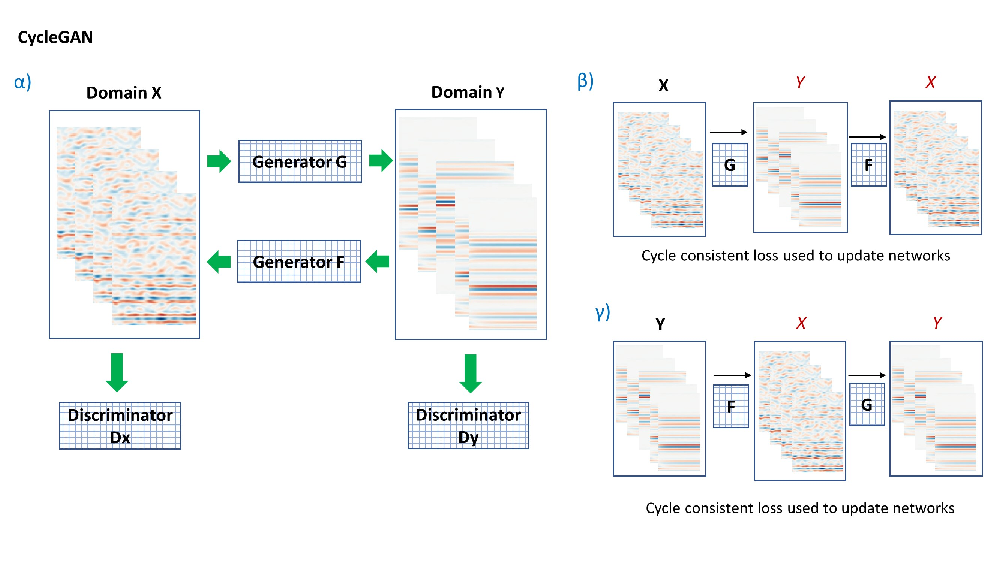
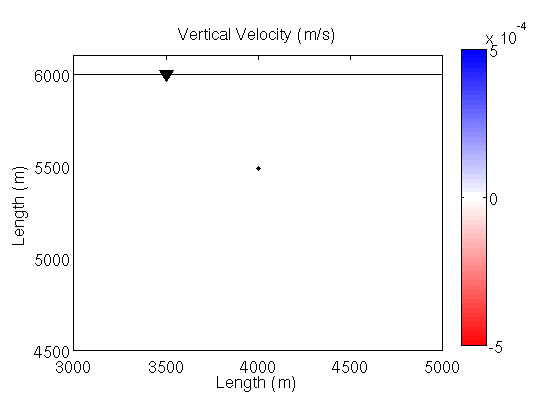
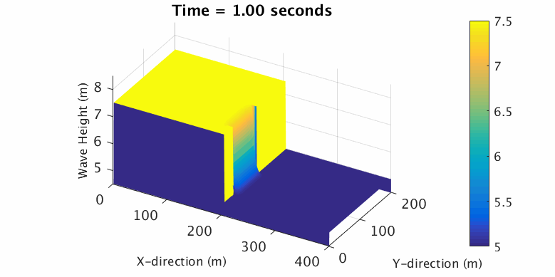
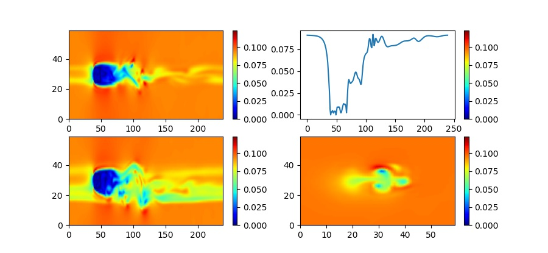
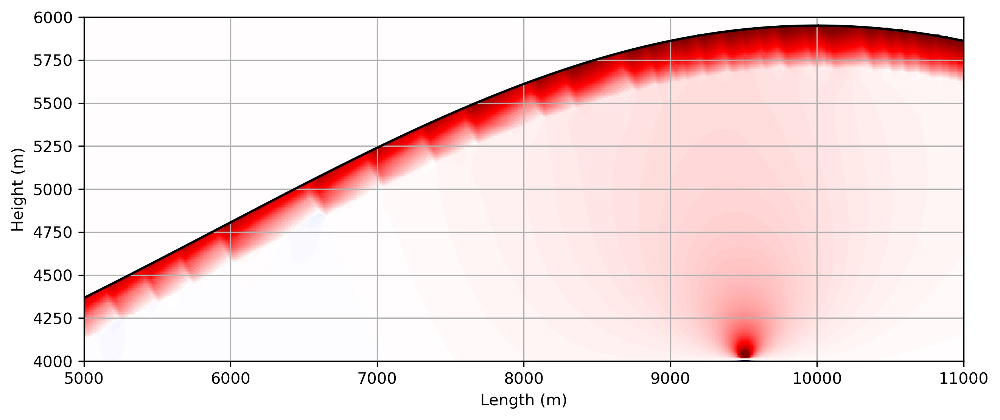

# Overview
The repositories store code that was written to cover the topics below. 
Some example results as animated gifs are used to illustrate the outputs.

Data Science: Exploiting high performance computing and data science techniques to process and image large 
datasets to image the subsurface within the business constraints for maximising commercial value. 
Examples include, i) using generative adversarial networks to translate complex geophysical images 
into human interpretable products, ii) using genetic algorithms as optimisation tools within the  
workflow. iii) Understanding the value of information arguments for assessing the business delivery of 
workflows relative to the impact and cost across the E&P workflow. THe ulimtate objective is to use data to make 
better business decisons through better de-risking or using quantifiable measures.

Predictive Analytic dashboard for sensor data streaming from an FPSO

Generative adversial neural networks deployed to clean seismic data for analysis

SIR Model of a generic pandemic across the Irish Population - worse case scenario with 
large Ro and no social distancing measures.

Geophysical Imaging: The most recent tools for imaging are Reverse Time Migration (RTM) and 
Full Wavefield Inversion (FWI). RTM imaging has shown to be hugely beneficial in imaging in 
complex geological regions, e.g. subsalt, whilst FWI has been used to develop high resolution 
velocity models which leads to better seismic images, can be fed into quantitative interpretation, 
used to image through gas clouds and used in hazard prediction.

Iterative conjugate gradient inversion to optimise data

Computational Seismology: Developing and implementing numerical methods to solve the elastic, 
visco-elastic and poroelastic wave equations in complex Earth models. This requires a strong background 
in seismic wave propagation and numerical methods along with programming on high performance 
computing hardware.

A vertical fault rupturing releasing energy which propagates as seismic waves

Geophysical fluid dynamics: Investigating single and multi-phase flow in complex porous structures 
including contaminant and reactive transport. Combining numerical models of subsurface fluid flow 
processes with static and dynamic rock deformation schemes enabling the simulation of fluid-rock 
interactions in a wide variety of geophysical applications.

Dam break and flow from one side to the other within a sealed box

Re=20,000 flow around a cube with turbulance using a cumulatant LBM method (Geier et al. 2015)

Gas bubbles flowing

Gas bubbles flowing

Hydrological modelling of a tracer through a fault zone using ADE solution

Volcano Seismology: Researching the seismic source mechanism in volcanic environments and seismic 
wave propagation in such media. Location of long-period volcano signals through novel high 
performance computing algorithms.

Ubinas volcano, Peru

Yasur volcano

Non-linear elastic deformation in low velocity shallow volcanic layers
